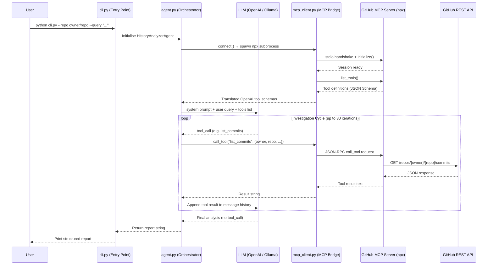

# 🔍 Commit History Analyzer Agent

> An AI-powered Git forensics agent that investigates repository history to uncover **why**, **when**, and **by whom** a behavior changed — using the **GitHub MCP Server** and a large language model.

---

## Table of Contents

- [Overview](#overview)
- [The Model Context Protocol (MCP)](#the-model-context-protocol-mcp)
  - [What is MCP?](#what-is-mcp)
  - [The GitHub MCP Server](#the-github-mcp-server)
  - [How It Is Used in This Project](#how-it-is-used-in-this-project)
- [Architecture & Workflow](#architecture--workflow)
- [Project Structure](#project-structure)
- [Features](#features)
- [Prerequisites](#prerequisites)
- [Setup & Installation](#setup--installation)
- [Configuration](#configuration)
- [Running on Any Repository](#running-on-any-repository)
- [Output Format](#output-format)
- [Testing](#testing)
- [LLM Backend Options](#llm-backend-options)

---

## Overview

The **Commit History Analyzer Agent** is a Python CLI application that autonomously investigates a GitHub repository's commit history to answer engineering questions such as:

- *"Why did authentication stop working?"*
- *"When was the resume scoring logic changed?"*
- *"Which commit removed the OAuth integration?"*

It works by coupling an **LLM** (OpenAI GPT-4o or a local Ollama model) with the **GitHub MCP Server** via the **Model Context Protocol**. The LLM plans the investigation and invokes GitHub API tools to gather real evidence — it never guesses, fabricates commit hashes, or invents data.

---

## The Model Context Protocol (MCP)

### What is MCP?

The **Model Context Protocol (MCP)** is an open standard developed by Anthropic that defines a universal, structured interface for AI models to interact with external tools, services, and data sources. Think of it as a **USB-C port for AI** — a single standard connector that allows any compliant AI model to plug into any compliant data source or tool server.

Without MCP, integrating an LLM with GitHub would require writing custom API wrapper code, managing authentication, parsing responses, and handling rate limits manually. MCP abstracts all of that into a standardized **tool schema** that any compliant LLM can understand and invoke.

Key characteristics of MCP:

| Property | Description |
|---|---|
| **Transport** | `stdio` (subprocess pipe), SSE, or HTTP |
| **Discovery** | Servers expose a `list_tools()` endpoint describing all available actions |
| **Invocation** | Clients call `call_tool(name, args)` and receive structured results |
| **Security** | Each server manages its own credentials; the AI model never sees raw tokens |
| **Interoperability** | Any MCP-compliant client can work with any MCP-compliant server |

---

### The GitHub MCP Server

This project uses the official **`@modelcontextprotocol/server-github`** server — an open-source MCP server maintained by Anthropic/GitHub that wraps the entire GitHub REST and GraphQL API surface into standardized, discoverable tools.

**It is launched as a child process via `npx`:**

```
npx -y @modelcontextprotocol/server-github
```

It reads your `GITHUB_PERSONAL_ACCESS_TOKEN` from the environment and exposes tools including:

| Tool | Description |
|---|---|
| `search_repositories` | Search GitHub for repositories matching a query |
| `list_commits` | List commits on a branch with filtering options |
| `get_commit` | Retrieve a specific commit's metadata and diff |
| `search_code` | Search code across the repository |
| `get_file_contents` | Read the contents of a specific file at a given ref |
| `list_pull_requests` | List PRs with state and metadata |
| `get_pull_request` | Get full PR details including review comments |
| `list_issues` | List issues with filtering |
| `get_issue` | Get a specific issue and its comments |
| `search_issues` | Search issues and PRs by keyword or label |

All credentials and HTTP communication are **entirely managed by the MCP server**. The Python agent only communicates with it via a `stdio` pipe — it never touches the GitHub API directly.

---

### How It Is Used in This Project

The MCP server is the **sole data access layer** for this agent. Here is exactly how it integrates:

#### 1. Subprocess Launch (Transport Layer)
`mcp_client.py` starts the GitHub MCP server as a child process via `StdioServerParameters` from the `mcp` Python SDK:

```python
# mcp_client.py
server_params = StdioServerParameters(
    command="npx.cmd",
    args=["-y", "@modelcontextprotocol/server-github"],
    env={"GITHUB_PERSONAL_ACCESS_TOKEN": token, ...}
)
```

The Python process and the Node.js MCP server communicate over `stdin`/`stdout` using the MCP protocol's JSON-RPC message format.

#### 2. Tool Discovery → OpenAI Schema Translation
After initialization, the agent calls `session.list_tools()` to retrieve all tools exposed by the GitHub MCP server. Each tool's name, description, and JSON Schema input definition are **automatically translated** into OpenAI's function-calling format:

```python
# mcp_client.py → list_tools()
{
    "type": "function",
    "function": {
        "name": tool.name,               # e.g. "list_commits"
        "description": tool.description, # forwarded to LLM
        "parameters": tool.inputSchema   # JSON Schema → OpenAI tool params
    }
}
```

This translated schema is then **sent to the LLM in every API call**, enabling the model to know exactly which GitHub capabilities are available.

#### 3. LLM-Driven Tool Orchestration (Agent Loop)
The core loop in `agent.py` runs as follows:

```
┌─────────────────────────────────────────────────────────────┐
│  1. Send system prompt + user query + full tools list       │
│     to the LLM                                              │
│                                                             │
│  2. LLM returns either:                                     │
│     a) A tool_call  →  execute via MCP, feed result back   │
│     b) Final text   →  display report to user              │
│                                                             │
│  3. Repeat until the LLM produces a final answer           │
│     (max 30 iterations)                                     │
└─────────────────────────────────────────────────────────────┘
```

When the LLM decides to call e.g. `list_commits`, the Python agent maps that call to  `session.call_tool("list_commits", {...})` — which the MCP server executes against the real GitHub API and returns the result via `stdout`. The agent appends the result to the message history and sends it back to the LLM for the next reasoning step.

#### 4. Result Synthesis
Once the LLM has gathered sufficient evidence through multiple tool calls, it synthesizes the information into a structured engineering report — entirely grounded in data fetched from GitHub, never from its own training knowledge.

---

## Architecture & Workflow



---

## Project Structure

```
Commit History Analyzer Agent/
│
├── cli.py              # Entry point — argument parsing and asyncio runner
├── agent.py            # Core LLM ↔ MCP orchestration loop & system prompt
├── mcp_client.py       # GitHub MCP Server connection, tool discovery & invocation
├── config.py           # Environment variable loading and validation
│
├── requirements.txt    # Python dependencies (mcp, openai, python-dotenv)
├── setup_env.bat       # Windows venv bootstrap script
│
├── test_agent.py       # Unit tests for config, client, and agent initialization
├── .env.template       # Template for required environment variables
├── .env                # Your actual secrets (never commit this)
└── README.md           # This file
```

---

## Features

- **Zero-guess policy** — the agent never invents data; all findings are sourced from GitHub via MCP tools
- **Multi-step reasoning** — the LLM performs up to 30 tool-call iterations drilling down into commits, diffs, PRs, and issues
- **Automatic context injection** — `owner` and `repo` parameters are auto-injected into every tool call so the LLM never needs to re-specify them
- **Dual LLM backend** — supports both OpenAI (cloud) and Ollama (local) via a single config flag
- **Neutral forensic reporting** — authors are never blamed; findings are presented objectively
- **Structured report output** — every run produces a consistent Summary / Root Cause / Evidence / Code Changes / Confidence report

---

## Prerequisites

- **Python 3.12+** (managed by the `py` launcher on Windows)
- **Node.js v18+** (to run the GitHub MCP server via `npx`)
- **A GitHub Personal Access Token (PAT)**:
  - **Fine-grained token (Recommended):** Grant **Read-only** access to *Contents*, *Issues*, and *Pull requests* on the specific repositories you target
  - **Classic token:** Requires the `repo` scope
- **An LLM backend:**
  - **OpenAI:** A valid API key with billing enabled at [platform.openai.com](https://platform.openai.com)
  - **Ollama (local):** [ollama.ai](https://ollama.ai) installed with a tool-capable model pulled (e.g., `qwen2.5:7b`)

---

## Setup & Installation

**1. Bootstrap the Python virtual environment:**
```cmd
.\setup_env.bat
```

**2. Activate the virtual environment:**

```cmd
# Command Prompt
venv\Scripts\activate.bat

# PowerShell
.\venv\Scripts\Activate.ps1
```

---

## Configuration

Copy `.env.template` to `.env` and fill in your credentials:

```ini
# Required
GITHUB_PERSONAL_ACCESS_TOKEN=your_github_pat_here

# LLM Backend — choose "openai" or "ollama"
LLM_BACKEND=openai

# If using OpenAI
OPENAI_API_KEY=your_openai_api_key_here
OPENAI_MODEL=gpt-4o                   # optional, defaults to gpt-4o

# If using Ollama
OLLAMA_BASE_URL=http://localhost:11434/v1   # optional, this is the default
OLLAMA_MODEL=qwen2.5:7b                    # or llama3.1:8b, mistral-nemo, etc.
```

---

## Running on Any Repository

The agent works with **any public or private GitHub repository** your PAT has access to. The repository is specified as `owner/repo`.

```bash
python cli.py --repo <owner>/<repo> --query "<your investigation query>"
```

### Examples

```bash
# Public repository
python cli.py \
  --repo octocat/Hello-World \
  --query "Why did authentication stop working?"

# Your own private repository
python cli.py \
  --repo SAMI-CODEAI/Controlled-AI-Resume-Personalization \
  --query "When was the resume scoring logic changed?"

# Open source project investigation
python cli.py \
  --repo expressjs/express \
  --query "When was the router middleware refactored?"

# Specify a custom model
python cli.py \
  --repo myorg/myrepo \
  --query "Which commit broke the payment integration?" \
  --model gpt-4o
```

> **Tip for private repos:** Use a fine-grained PAT and explicitly grant access to the specific repository. This is more secure than a classic token with full `repo` scope.

---

## Output Format

Every run produces a structured report:

```
==================================================
FINAL ANALYSIS REPORT
==================================================
Summary
<One paragraph explaining what happened.>

Root Cause
<The specific change that caused the behavioral difference.>

Evidence
Commit: <hash>
Author: <name>
Date: <ISO date>
Changed Files: <file1>, <file2>
Commit Message: "<message>"
Related PR: <#number or None>

Code Changes
<Summary of lines removed and added.>

Confidence
<High / Medium / Low> — <Reason for confidence level.>
==================================================
```

---

## Testing

Run the unit test suite to verify module initialization and configuration logic:

```bash
venv\Scripts\python -m unittest test_agent.py
```

Expected output:
```
....
----------------------------------------------------------------------
Ran 4 tests in 0.162s

OK
```

---

## LLM Backend Options

| Backend | Model Examples | Tool Calling | Setup |
|---|---|---|---|
| **OpenAI** (recommended) | `gpt-4o`, `gpt-4-turbo` | Excellent | API key + billing required |
| **Ollama – qwen2.5:7b** | `qwen2.5:7b` | Good | `ollama pull qwen2.5:7b` |
| **Ollama – mistral-nemo** | `mistral-nemo` | Good | `ollama pull mistral-nemo` |
| **Ollama – llama3.1:8b** | `llama3.1:8b` | Limited | May not follow tool schema reliably |

> For best results with Ollama, use `qwen2.5:7b` or larger. Models under 7B parameters typically cannot reliably follow structured tool-calling schemas.
