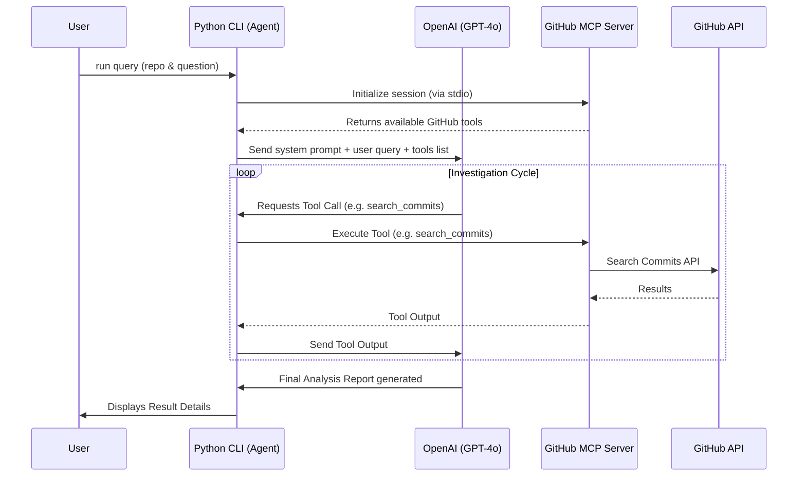

# Commit History Analyzer Agent

An AI agent specializing in investigating Git repository history to identify why or when a behavior changed in a GitHub repository. It integrates the OpenAI API and the GitHub Model Context Protocol (MCP) server.

## Features
- **Git History Search:** Searches commit messages, PRs, and repository history using keywords.
- **Diff Analysis:** Inspects commit contents, file changes, and patches.
- **Context Gathering:** Reviews associated issues, pull requests, and nearby commits.
- **Structured Reports:** Formats findings in a clean, developer-friendly layout detailing the root cause, evidence (commit hashes, authors, dates), code changes, and a confidence rating.

---

## How It Works

### Flowchart 



### The MCP Server
This project utilizes the **`@modelcontextprotocol/server-github`** MCP server. 
The Model Context Protocol (MCP) is an open standard that enables AI models to securely interact with local and remote resources. In this project, the GitHub MCP Server acts as a standardized bridge. Instead of writing custom API integration code for GitHub, the Python agent connects to the MCP server via `stdio`. The server exposes standardized "tools" (such as reading files, searching commits, fetching PRs) which our Python client then translates into OpenAI tool-calling schemas. When the LLM decides to search for a commit, the agent relays that command directly to the MCP server, which interfaces with GitHub's APIs securely using your Personal Access Token.

---

## Setup & Configuration

### Prerequisites
- Python 3.12+ (managed by `py` on Windows)
- Node.js (v24.0.0+ recommended) to run the MCP server via `npx`
- A GitHub Personal Access Token (PAT):
  - **Fine-grained token (Recommended):** Requires **Read-only** permissions for *Contents*, *Issues*, and *Pull requests* on the target repositories you wish to analyze.
  - **Classic token:** Requires the **`repo`** scope.
- An OpenAI API Key

### Installation

1. Run the setup script to initialize the virtual environment and install Python dependencies:
   ```cmd
   .\setup_env.bat
   ```

2. Activate the virtual environment:
   - **Command Prompt (CMD):**
     ```cmd
     venv\Scripts\activate.bat
     ```
   - **PowerShell:**
     ```powershell
     .\venv\Scripts\Activate.ps1
     ```

### Configuration
Create a `.env` file in the root of the project (copying `.env.template`) and populate it:
```ini
OPENAI_API_KEY=your_openai_api_key
GITHUB_PERSONAL_ACCESS_TOKEN=your_github_personal_access_token
```

---

## Usage: Running on ANY Repository

You can run this project against **any repository on GitHub**, as long as your Personal Access Token (PAT) has access to it. 

**Steps to run on your own repositories:**
1. Generate a GitHub PAT.
   * If the repository is **Private**, make sure your PAT has access to that specific repository. A fine-grained token where you explicitly select the repository (with Read access to Contents, Issues, and PRs) is highly recommended.
2. Put the token in your `.env` file as `GITHUB_PERSONAL_ACCESS_TOKEN`.
3. Locate the `owner` and `repo` name of the repository you want to analyze (e.g., if the URL is `https://github.com/my-username/my-project`, the repo path is `my-username/my-project`).

Run the agent via CLI by supplying the repository path and your investigation query:

```bash
python cli.py --repo <owner>/<repo> --query "Your query here"
```

### Examples

**Investigating a broken behavior in a public repo:**
```bash
python cli.py --repo octocat/Hello-World --query "Why did authentication stop working?"
```

**Finding when a feature was removed:**
```bash
python cli.py --repo facebook/react --query "When was OAuth support removed from the dev package?"
```

**Running on your own private repository:**
*(Ensure your token has permission for `your-username/private-backend-app`)*
```bash
python cli.py --repo your-username/private-backend-app --query "Which commit caused the database schema validation to fail on user login?"
```

---

## Testing

Run the automated suite to verify the agent's client mapping and initialization logics:
```bash
python -m unittest test_agent.py
```
